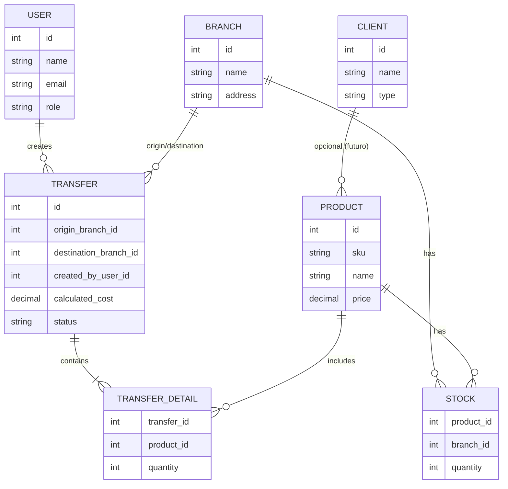

# ManCast — Documento de Requerimientos (v0.1)

> Documento vivo. Se actualiza al final de cada fase con lo que realmente se implementó vs. lo planeado.

## 1. Contexto y objetivo

ManCast es un sistema de gestión y distribución multi-sucursal. Permite administrar
productos, clientes y proveedores, y controlar el traslado de mercancía entre sucursales,
incluyendo el cálculo de costos asociados a cada traslado.

**Objetivo del proyecto (aprendizaje):** practicar un flujo de trabajo real de desarrollo
multi-servicio (Laravel + Angular + .NET) usando Docker y Git/GitHub con buenas prácticas
de documentación, control de versiones y CI/CD.

## 2. Alcance

**Dentro del alcance (MVP):**
- CRUD de productos, clientes y proveedores (Laravel)
- Autenticación con JWT y roles básicos (admin, vendedor)
- CRUD de traslados entre sucursales con cálculo de costo (.NET)
- Validación de stock disponible antes de crear un traslado (comunicación Laravel ↔ .NET)
- Frontend único en Angular que consume ambas APIs
- Entorno reproducible con Docker Compose

**Fuera de alcance (por ahora):**
- Facturación fiscal / timbrado
- Pagos en línea
- Notificaciones push/email
- Multi-idioma

## 3. Actores / roles

| Rol | Descripción |
|---|---|
| Admin | Acceso total: productos, clientes, usuarios, traslados, reportes |
| Vendedor | Puede ver productos/clientes y solicitar traslados, sin acceso a reportes financieros |

## 4. Requisitos funcionales

### 4.1 Módulo Productos y Clientes (Laravel)
- RF-01: El sistema debe permitir crear, editar, listar y desactivar productos (nombre, SKU, precio, stock por sucursal)
- RF-02: El sistema debe permitir crear, editar y listar clientes y proveedores
- RF-03: El sistema debe autenticar usuarios y emitir un token JWT
- RF-04: El sistema debe exponer un endpoint de consulta de stock por producto/sucursal, consumible por otros servicios

### 4.2 Módulo Traslados (.NET)
- RF-05: El sistema debe permitir crear un traslado indicando sucursal origen, destino, productos y cantidades
- RF-06: Antes de confirmar un traslado, el sistema debe validar stock disponible consultando al servicio de Laravel
- RF-07: El sistema debe calcular el costo del traslado (costo base + variable por distancia/peso)
- RF-08: El sistema debe generar un reporte de traslados por rango de fechas con totales

### 4.3 Frontend (Angular)
- RF-09: El usuario debe poder iniciar sesión y mantener su sesión activa mientras el token sea válido
- RF-10: El usuario debe poder ver, crear y editar productos/clientes desde la UI
- RF-11: El usuario debe poder crear traslados y ver su estado/costo calculado

## 5. Requisitos no funcionales

- RNF-01 (Seguridad): las contraseñas se almacenan con hash (bcrypt); el JWT tiene expiración configurable
- RNF-02 (Portabilidad): todo el sistema debe levantarse con un solo `docker compose up`
- RNF-03 (Mantenibilidad): cada servicio documentado con Swagger/OpenAPI
- RNF-04 (Trazabilidad): cada feature se desarrolla en una rama propia y se integra vía Pull Request

## 6. Modelo de datos preliminar (borrador)

> Nota: `USER`, `PRODUCT`, `CLIENT`, `STOCK` viven en la base de datos de Laravel (MySQL).
> `TRANSFER` y `TRANSFER_DETAIL` viven en la base de datos de .NET (SQL Server).
> No hay foreign keys reales entre ambas — la integridad se valida vía API, no vía base de datos.
> Esto es intencional: es el mismo reto que existe en arquitecturas de microservicios reales.

## 7. Glosario

- **Traslado**: movimiento de productos de una sucursal a otra
- **Stock**: cantidad disponible de un producto en una sucursal específica
- **JWT**: JSON Web Token, usado para autenticación sin estado entre servicios

## 8. Historial de cambios

| Fecha | Cambio |
|---|---|
| Fase 0 | Versión inicial del documento |
